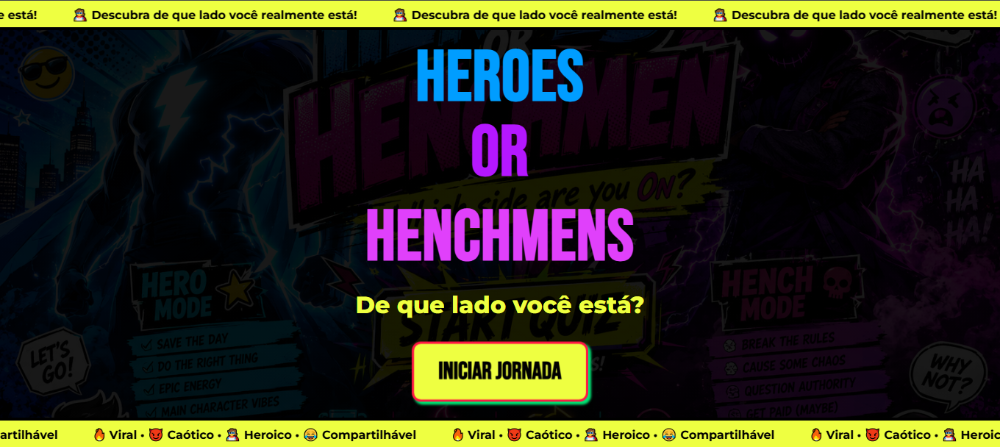

<h2 id="sobre-o-projeto">1. ⚡ Heroes Or Henchmens - Web App Quiz 🦹‍♂️🦸‍♂️</h2>


[](https://github.com/Domisnnet/Heroes-Henchmens-Angular/blob/main/LICENSE)


Bem-vindo ao repositório oficial do **Heroes or Henchmens**! Esta aplicação é um quiz interativo e imersivo desenvolvido em **Angular**, projetado para descobrir se a personalidade do usuário se alinha com o lado dos heroicos defensores ou dos caóticos capangas. O projeto combina estilização avançada e agressiva em **SCSS** com uma infraestrutura otimizada de entrega estática no **Firebase Hosting**.

---

## 📚 Tabela de Conteúdo

| 💻 O Projeto | 🛠️ Técnico | 🤝 Comunidade |
| :---: | :---: | :---: |
| [](#sobre-o-projeto) | [](#destaques-tecnicos) | [](#codigo-fonte) |
| [](#tecnologias-utilizadas) | [](#fluxo-de-deploy) | [](#créditos) |
| [](#como-acessar) | [](#como-contribuir) | [](#licenca) |
| [](#funcionalidades) | [](#faq) | [](#perfil-do-github) |

---

<h2 id="tecnologias-utilizadas">2. ⚙️ Tecnologias Utilizadas</h2>

| Camada | Tecnologias | Descrição |
| :--- | :--- | :--- |
| **Core** |  | Framework SPA com arquitetura reativa e Standalone Components. |
| **Style** |  | SCSS modular para gerenciamento da paleta contrastante e animações. |
| **Backend/Host** |  | Hospedagem estática segura via CDN global rápida. |
| **Roteamento** |  | Gerenciamento de fluxo entre Home, Quiz e Resultado. |

---

<h2 id="como-acessar">3. 🚀 Como Acessar</h2>

Escolha o seu lado e inicie sua jornada clicando no botão abaixo:

<div align="left">
  <a href="https://heroes-henchmen.web.app" target="_blank">
    
  </a>
</div>

---

<h2 id="funcionalidades">4. 🧩 Funcionalidades Principais</h2>

| Funcionalidade | Descrição |
| :--- | :--- |
| 🛡️ **Modularidade Standalone** | View-components (`home`, `quiz`, `result`) isolados e carregados via *Lazy Loading* assíncrono. |
| 🎛️ **State Management Reativo** | Motor lógico que computa as respostas do usuário em tempo real para definir o resultado final. |
| 📱 **Responsive Comic Interface** | Design adaptativo inspirado em quadrinhos com quebras de layout fluidas para Desktop e Mobile. |
| ⚡ **SPA Router Rewrites** | Sistema de rotas limpas mapeadas no Firebase para evitar erros 404 ao atualizar a página. |
| 🎨 **Themed UI Overlays** | Uso intenso de tipografias marcantes, bordas bem definidas e elementos em alta saturação. |

---

<h2 id="destaques-tecnicos">5. 💻 Destaques Técnicos</h2>

### 🔀 Arquitetura de Rotas e Lazy Loading
Para maximizar a velocidade de carregamento inicial, o core da aplicação foi planejado para carregar os pedaços (chunks) lógicos de forma preguiçosa. Os componentes de Quiz e Resultado só são baixados pelo navegador à medida que o usuário avança no fluxo da jornada.

### 🌐 Deploy de SPA Puro (Static-First)
A aplicação foi otimizada para rodar de forma puramente estática, eliminando sobrecargas no servidor. O arquivo `firebase.json` está integrado cirurgicamente à pasta de saída do compilador do Angular (`dist/heroes-henchmen/browser`), garantindo entregas instantâneas.

---

<h2 id="fluxo-de-deploy">6. 📦 Fluxo de Deploy</h2>

O deploy da aplicação utiliza Firebase Hosting integrado ao GitHub.
Para publicar uma nova versão basta executar:
```bash
ng build --configuration production
```
Em seguida:
```bash
firebase deploy
```
---

<h2 id="como-contribuir">7. 🤝 Como Contribuir</h2>

Siga os passos abaixo para fortalecer este projeto e sugerir melhorias:

| Fase | Ação | Link / Comando |
| :---: | :--- | :--- |
| **01** | **Fork** | [](https://github.com/Domisnnet/Heroes-Henchmens-Angular/fork) |
| **02** | **Branch** | `git checkout -b feature/MinhaMelhoria` |
| **03** | **Commit** | `git commit -m 'feat: add nova seção de projetos'` |
| **04** | **Push** | `git push origin feature/MinhaMelhoria` |
| **05** | **PR** | [](https://github.com/Domisnnet/Heroes-Henchmens-Angular/compare)

### 🐛 Encontrou um problema?
Se algo não estiver funcionando como esperado, não hesite em abrir um chamado:

[](https://github.com/Domisnnet/Heroes-Henchmens-Angular/issues)
[](https://github.com/Domisnnet/Heroes-Henchmens-Angular/issues/new)


---

<h2 id="faq">8. 🧠 Perguntas Frequentes</h2>

<details>
<summary><strong>Por que o projeto não utiliza SSR (Server-Side Rendering) ❓</strong></summary>
<p>⚡ <strong>Resposta:</strong> Como se trata de um web-game sem dependência de banco de dados ou painel dinâmico administrativo, rodar o app de forma puramente estática garante custo zero de processamento e tempos de resposta absurdamente menores.</p>
</details>

<details>
<summary><strong>Como o Firebase redireciona as rotas internas ❓</strong></summary>
<p>🔄 <strong>Resposta:</strong> SPAs controlam as rotas no navegador. Para evitar erros ao recarregar a URL, usamos a regra de <code>rewrites</code> no <code>firebase.json</code>, fazendo com que qualquer caminho aponte para o <code>index.html</code> que sabe gerenciar a rota interna correta.</p>
</details>

<details>
<summary><strong>Como as respostas do Quiz são calculadas ❓</strong></summary>
<p>🧮 <strong>Resposta:</strong> Cada alternativa selecionada pontua de forma reativa no estado interno do componente de fluxo. Ao chegar no final, um agregador lógico pondera as escolhas e entrega a view do resultado correspondente.</p>
</details>

<details>
<summary><strong>Posso criar novos temas visuais baseados neste código ❓</strong></summary>
<p>🎨 <strong>Resposta:</strong> Com certeza! A estrutura modular em SCSS permite criar variáveis globais de estilo para mudar fontes, cores e backgrounds mantendo a lógica de navegação intacta.</p>
</details>

<details>
<summary><strong>Posso utilizar este código em meu Portfólio e/ou Projeto pessoal ❓</strong></summary>
<p>🤝 <strong>Resposta:</strong> Com certeza. O projeto é <strong>Open Source</strong>. Você pode clonar, estudar a estrutura de pastas e utilizar como base para seus próprios estudos de UI, desde que mantenha a atribuição original conforme a <strong>Licença MIT</strong> e não se esqueça de dar os devidos créditos!!.</p>
</details>

---

<h2 id="codigo-fonte">9. 💻 Código Fonte</h2>

Explore a arquitetura Angular completa no repositório oficial:


[](https://github.com/Domisnnet/Heroes-Henchmens-Angular)

---

<h2 id="créditos">10. 📝 Créditos & Reconhecimentos</h2>

| Atribuição | Responsável / Recurso | Descrição |
| :--- | :--- | :--- |
| **Full-Stack Dev** | **DomisDev** | Design, Arquitetura Angular e Configuração DevOps. |
| **Infraestrutura** | **Google Firebase** | Provedor de Hosting e serviços cloud. |
| **Apoio Técnico** | **Google Gemini** | Padronização e refinamento documental. |

---

<h2 id="licenca">11. 📄 Licença</h2>

Este projeto está sob a [](https://github.com/Domisnnet/Heroes-Henchmens-Angular/blob/main/LICENSE)

---

<h2 id="perfil-do-github">12. 👨‍💻 Perfil do GitHub</h2>

<a href="https://github.com/Domisnnet"> 
   
</a>
